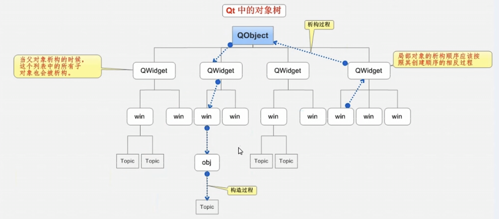
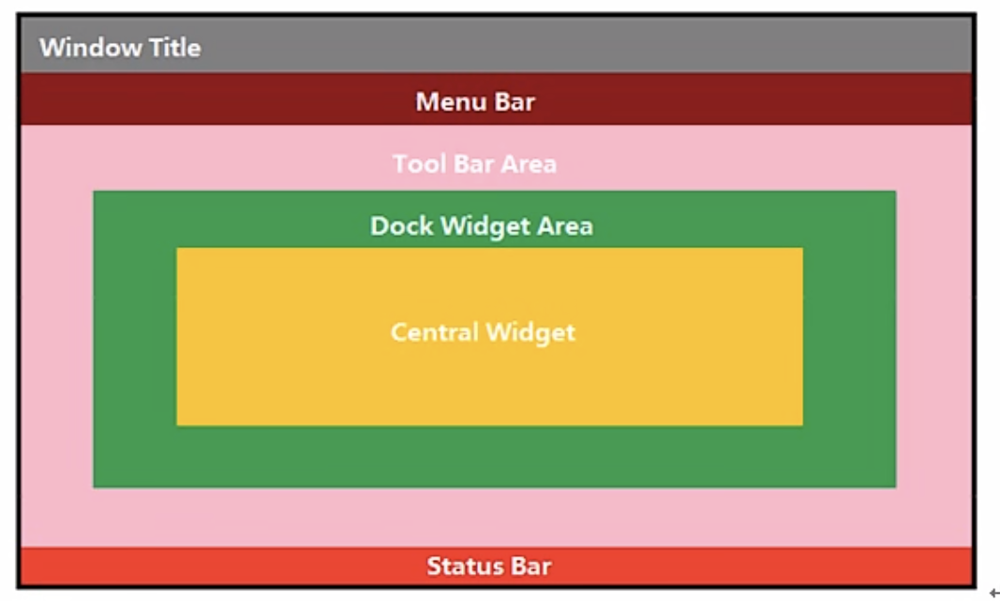

# qt tutorial

## First Day

### ```.Pro```

Qt setting file,please don't alter it if you don't know how to use this file. Look for your function in the qt assistant document and it will to tell you what to add in ```qmake``` position.

### ```ObjectTree```



using ```new``` to create object,it will be released automatically if assigned parent class. 

### ```Qt coordinate system ```
1. Top-left corner is ```origin``` 0,0
2. Horizontal is ```x```
3. Vertical is ```y```

### ```Function```

```show()```  to show window in the top.

```setFixedSize()``` to set fixed window size.

```setWindowTitle()``` to set windows title.

```QpushButton``` to create a new button.

```btn->setParent()``` set button in main window panel.

```btn->setText()``` to set button text.

```btn->move()``` to set button 's position in main window panel.

```Qstring::ToUtf8()``` turn ```string``` to ```ByteArray```

```Qstring::data()``` turn ```ByteArray``` to ```char * ```

### ```Signal and slot```
The signal **send** and **receive** is irrelevant

**Signal**

1. Signal need declare, don't need implement.
2. Return void.
3. You must write it under ```signal:``` of the ```.h``` file.

**Slot**

1. Slot need declare and implement.
2. Return void.
3. You can write it anywhere in the ```.h``` file.


**Function Overloading**

```C++
	void (teacher::*teacherhung)() = &teacher::hungry;
    void (student::*studenttreat)() = &student::treat;
    connect(te,teacherhung,su,studenttreat);
```

**Connect**

1. Parameter: send,signal,receive,slot
2. Using ```emit``` to call custom signal.

**Disconnect**

1. Parameter: send,signal,receive,slot
2. Just interrupt the connect that ```signal ``` and ```slot```

### QMainWindow



**Tips: only exist one using ```set```, allow exist multiple using ```add```**

**QmenuBar**

1. ```QmenuBar -> Qmenu -> action ```
2.  ```setMenuBar```  

**QToolBar**

1. ```QToolBar -> action ```
2.  ```addToolBar```

**QStatusBar**

1. ```QStatusBar -> QLabel ```
2. ```addStatusBar```

**QDockWidget**

1. ```QDockWidget```
2. ```addDockWidget```

**QDialog**

It have two models : Modal and non-modal 

```C++
//no modal
        QDialog *qd1 = new QDialog(this);
        qd1->resize(100,100);
        qd1->show();
        qd1->setAttribute(Qt::WA_DeleteOnClose);
//modal
        QDialog qd(this);
        qd.resize(100,100);
        qd.exec();
```

**MessageBox**

1. ```MessageBox::critical()```
2. ```MessageBox::information()```
3. ```MessageBox::question()```
4. ```MessageBox::warning()```

```c++
//example
QMessageBox::critical(this,"title","please input");
QMessageBox::information(this,"title","please input");
QMessageBox::warning(this,"titil","input");
QMessageBox::question(this,"title","sure?",QMessageBox::Yes | QMessageBox::No,QMessageBox::Yes);
```

**Other Standard Dialog**

1. ```QColorDialog```
2. ```QFileDialog```
3. ```QFontDialog```

```c++
//QcolorDialog
QColor Q1 = QColorDialog::getColor(QColor(255,0,0));
qDebug()<< Q1.red() << Q1.green() <<Q1.blue();

//QfileDialog
QString dir = QFileDialog::getOpenFileName(this,"name","~/");
qDebug()<< dir;

//QfontDialog
bool flag;
QFont f1 = QFontDialog::getFont(&flag,this);
qDebug()<< f1.family() ;
```

