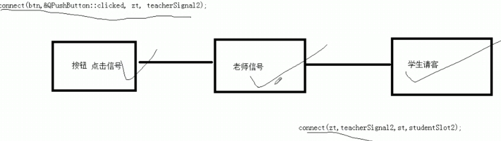

## QT从入门到实战Wiki教程

### 05 命令规范以及快捷键

~~~c++
.pro文件：
QT += core gui //QT包含的模块
greaterThan(TT_MAJOR_VERSION,4):QT += widgets //兼容的版本
TARGET = 01_Name //生成目标程序的名称
TEMPLATE = app //模板 app是应用程序模板

SOURCES += main.cpp\  //源代码（不用管，自动生成的）
    		a.cpp\
    		b.cpp
HEADERS += mywidget.h  //头文件（不用管，自动生成的）
~~~

> Q_OBJECT 是宏，允许类中使用信号和槽

~~~
命名规范：
类名：首字母大写，单词和单词之间首字母大写
函数名，变量名：首字母小写，单词和单词之间首字母大写
    
快捷键：
    注释：ctrl + /
    运行：ctrl + r
    编译：ctrl + b
    查找：ctrl + f
    整行移动：ctrl + shift + 方向键
    帮助文档：F1
    自动对齐：ctrl + i
    同名之间.h和.cpp切换：F4
    
帮助文档：
    1. F1
    2. 左侧列表
    3. 版本-》 版本号 -》mingw版本-》 bin -》 assistant.exe
~~~

### 06 QPushButton

~~~text
//创建按钮
QPushButton *btn = new QPushButton;
// 设置父亲
btn->setParent(this)
// 设置文字
btn->setText("name")
// 移动窗口
btn->move(x,y)
~~~

#### Qwidget

~~~
//重置窗口大小
resize(400,400)
//设置固定窗口大小
SetFixedSize(400,400)
//设置窗口标题
setWindwosTitle("name")
~~~

### 07 对象树

### 08 QT坐标系

### 09 信号和槽

~~~
按钮 -> 点击 -> 窗口 -> 关系
connect(信号发送者,发送具体信号,信号接收者,信号的处理)
第一个参数: 发送者变量
第二个参数: 父类或者自己的信号(注意,他是一个函数地址)
第三个参数: 接收者变量
第四个参数: 父类或者自己的槽(注意,他是一个函数地址)

槽实质上是函数,我们这里放置一个无名函数,或者lambda表达式也是可以的.
然后在无名函数中,执行多个槽函数
例子:
connect(btn,&QPushButton::clicked,this,&mywidget::close)
~~~

信号和槽的特点:**松散耦合的,即两端本身是无关联的,通过connnect将两端耦合起来.**

### 10 自定义信号和槽

1. 信号函数

   1. 自定义信号写到**signals**下
   2. 返回值是void,只需要声明,不需要实现
   3. 可以有参数,可以重载

2. 槽函数

   1. 返回值void,需要声明,需要实现
   2. 可以有参数,可以重载

3. 手动触发自定义信号

   > **emit zt-> hungry(); **
   >
   > 触发zt中的hungry信号

### 11 信号和槽发生重载

~~~
老师饿了学生请客
信号:void hungry(Qstring name);
函数指针: 
void(*teacherSignal)(Qstring) = &Teacher::hungry;
void(*studentslot)(Qstring) = &student::treat;
信号和槽:需要自己放函数指针
connect(btn,teacherSignal,this,studentslot)
传参:
Qstring 从hungry 传到 connect, connect再转到treat
~~~

想要Qstring输入无引号:

QString 转到 QByteArray,再转到char* 

~~~
QString.toUTF8().data();
~~~

### 12 信号连接信号,断开信号

~~~
无参的信号连接信号
信号:void hungry(void);
函数指针: 
void(*teacherSignal)(void) = &Teacher::hungry;
void(*studentslot)(void) = &student::treat;
信号和槽:需要自己放函数指针
connect(btn,teacherSignal,this,studentslot)
~~~

断开信号:

​	只需要将connect 换成 disconnect即可

~~~ 
disconnect(btn,teacherSignal,this,studentslot)
~~~

### 13 Lambda表达式

Lambda表达式本质是 **创建匿名函数**,省的命名太多,分不清楚 

 注意:lambda执行完之后会立马释放对象,所以需要放在堆上.

格式：

~~~textc++
->int{};lambda表达式声明

[]中的参数:
空,不适用任何变量
=,值传递使用所有局部变量
&,引用传递使用所有局部变量
this,lambda所在类的所有变量
a,值传递变量a
&a,引用传递变量a

()中的参数:
创建变量

->int 参数:
声明返回值类型

{}参数:
函数体

mutable声明:加上之后可以修改按值传递的拷贝.
mutable->int{}();调用lambda表达式
~~~

### 14 QMainWindows

~~~
//重置窗口大小
resize(600,300)
//菜单栏创建
QmenuBar *bar = menuBar();
//将菜单栏放入窗口
setMenuBar(bar);

//创建菜单
QMenu * fileMenu = bar->addMenu("文件");
QMenu * editMenu = bar->addMenu("编辑");
//创建菜单项
fileMenu->addAction("新建");
//添加分隔符
fileMenu->addSparator();

//工具栏
QToolBar *toolBar = new QToolBar(this);
//添加工具
addToolBar(toolBar);
//后期停靠
toolBar->setAllowAreas(Qt::LeftToolBarArea | Qt::RightToolBarArea)
//设置浮动
toolBar->setFloatable(false);
//设置移动总开关
toolBar->setMoveable(false);
//创建菜单项
QAction *newAction = new QAction();
//工具栏中添加工具
toolBar->addAction(newAction);
//工具栏中添加控件
QPushButton *btn = new QPushButton("a",this);
toolBar->addWidget(btn);
~~~

### 15 状态栏

~~~
//创建状态栏
QStatusBar *stBar = statusBar();
//放置到窗口中
setStatusBar(stBar);
//创建标签
QLabel  *label = new Qlabel("tishi",this);
//标签放右侧 
stBar->addWidget();
//浮动窗口
QDockWidget *dockWidget = new QDockWidget("float",this);
~~~

### 16 资源文件添加

1. 准备的图片资源放到项目中
2. 项目右键,添加新文件
3. 选择QT,选择Qt Resource File
4. 给资源文件命名
5. 在资源中找到,在编辑器中打开
6. 添加前缀,区分不同的资产

### 17 模态和非模态对话框

非模态对话框: 创建窗口后,**可以**对其他窗口进行操作,模态不可以操作

~~~
//创建模态
QDialog dlg(this);
dlg.exec();

//创建非模态
QDialog *dlg2 = new QDialog(this);
dlg2->show();

//设置属性,关闭的时候释放对象
dlg2->setAttribut(Qt:deleteOnClose);
~~~

### 18 消息对话框

在槽的位置写上无名函数,然后消息对话框放入无名函数中.

常用QMessageBox对话框:

1. QMessageBox::critical()错误对话框
2. QMessageBox::information()消息对话框
3. QMessageBox::question()提问对话框
4. QMessageBox::warning()警告

### 19 其他对话框

~~~
//颜色对话框QColorDialog
Qcolor color = QColorDialog::getColor(Qcolor(255,0,0))

//文件对话框QFileDialog,最后一个参数为过滤*.txt的
QFileDialog::getopenFileName(this,"open file","路径","(*.txt)");

//字体对话框
bool flag;
Qfont font = QFontDialog::getFont(&flag,QFont("黑色",36));
~~~

